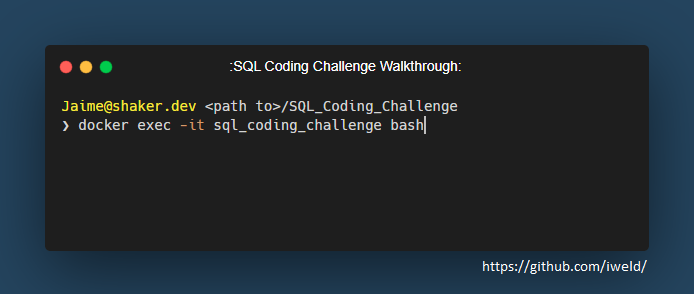
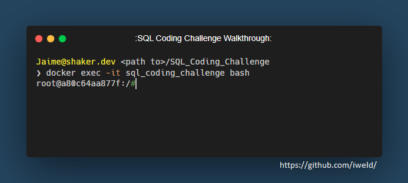
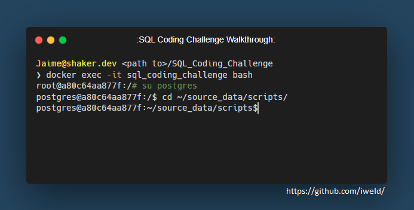
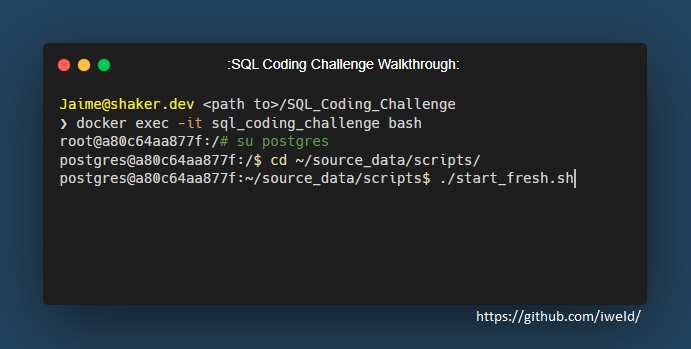

## Basic/Intermediate SQL Code Challenge

**Author**: Jaime M. Shaker <br />
**Email**: jaime.m.shaker@gmail.com <br />
**Website**: https://www.shaker.dev <br />
**LinkedIn**: https://www.linkedin.com/in/jaime-shaker/  <br />

:exclamation: If you find this repository helpful, please consider giving it a :star:. Thanks! :exclamation:

### Bash Script

What is Bash?  
* The name stands for **B**ourne **A**gain **SH**ell. It is an open source version of the Bourne Shell and was first released in 1989.  A shell is a command-line interpreter that provides a command line user interface for operating systems.

What is a Bash script?
* A Bash script is a plain text file which contains a series of commands. These are the commands we would normally type ouselves on the command line.  Using [psql](https://www.postgresguide.com/utilities/psql/), we can create a Bash script that will execute our `.sql` files in order and always start with a fresh, clean database everytime we run the script.

Do I have Bash on my computer?
* If you are following along this walk-through and using the Docker container, the answer is YES!  Bash is the default shell used in Linux and MacOS up to version 10.15 although it remains available as an alternative shell.

To use the Bash shell, let's connect to our Docker/PostgreSQL container by opening up another command line terminal and type in this command.

`docker exec -ti sql_coding_challenge bash`

 

 After executing this command, you should be logged into the Docker container as `root`.  Keep in mind that the `@a80c64aa877f` portion after `root` is the actual Docker ID for this container, which will be different for your unique container.

 

 We are logged in as the `root` user.  Let's `substitute user` with the `su` command.  Running around your file system as the `root` user can lead to problems if you don't know what you're doing.  In the terminal type and execute the command

 `su postgres`

 

 We are now connected to the container as the user `postgres`.  Now we can cd (change directory) to where our scripts are located which we initially set-up as the `/source_data/scripts/` directory..

 `cd ~/source_data/scripts/`

 We are now in our `source_data/scripts` directory.  
 
  
 
 Create a new file in the `source_data/scripts` directory and name it

 `start_fresh.sh`

 This is the Bash script that will execute the psql code.  Inside of the `start_fresh.sh` file,  the bash script should look like this.

 ```bash
 #!/bin/bash

psql sql_coding_challenge -f drop_all_tables.sql
psql sql_coding_challenge -f build_tables.sql
psql sql_coding_challenge -f normalize_tables.sql
psql sql_coding_challenge -f remove_duplicates.sql
psql sql_coding_challenge -f cleanup_db.sql
psql sql_coding_challenge -f create_relationships.sql
echo "Build Process Complete"
 ```

To run this script, use the following command in the same directory as the script.

`./start_fresh.sh` or `bash start_fresh.sh`

:exclamation:  Note: :exclamation: 
* If upon trying to run the script you receive a `Permission Denied` error, you must run this command first, then try again.
	* `chmod u+x start_fresh.sh`



Once the script starts, it will start executing the `.sql` files we just created and once it's complete, should look something similar to this.


We are now right back to where we were when we first started this page.  

However, now we have a script that we can run our SQL files and produce a fresh set-up all the time, everytime.

We are now ready to complete the `SQL Coding Challenge`.

click the link below

Go to [WALKTHROUGH_CODE_CHALLENGE](WALKTHROUGH_7_CODE_CHALLENGE.md)

:exclamation: If you find this repository helpful, please consider giving it a :star:. Thanks! :exclamation:


